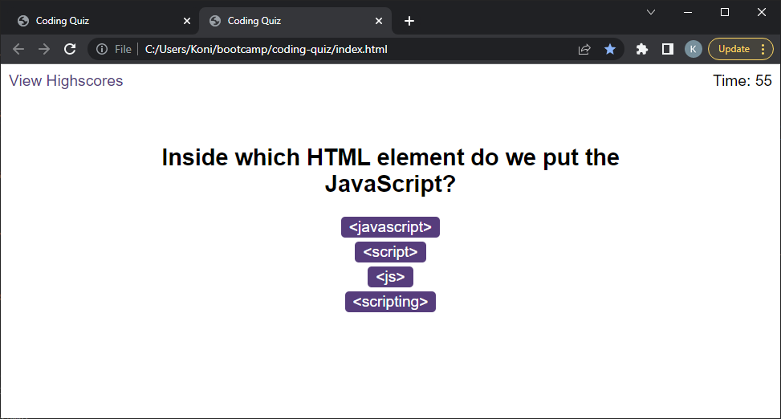

# Coding Quiz

A timed coding quiz with multiple choice questions running in the browser

## Description

This project will present the user with a timed coding quiz with multiple-choice questions.  The aim is to prepare the user for coding interviews which may contain multiple-choice based coding questions. 

### Repository

https://github.com/digitinok/coding-quiz

### Deployed Page

https://digitinok.github.io/coding-quiz/

## Installation

This app will run in the browser, and will feature dynamically updated HTML and CSS powered by JavaScript code.

## Usage

The quiz runs in the browser and starts the questions with multiple choice answers after clicking the start button.  The quiz finishes if either all the questions are answered with a time bonus or when the timer runs out.  But be aware, you'll loose 10 seconds for every wrong answer.

This is how the deployed pages looks like:

Screenshot of deployed Questions Page

Screenshot of deployed Highscore Page

## Future Improvements

Furture improvements will include randomization of the questions and answers, so that the user doesn't learn the position of questions and answers.

## Credits

N/A

## License

This project uses the MIT License. Please see the license file in the repositiry for fursther details.